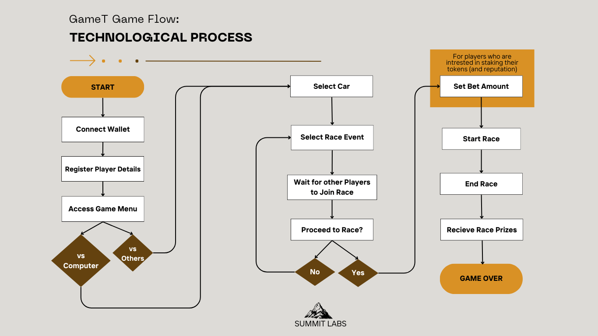

# GAMET: Where Speed Meets Blockchain

*Skill Meets Speed: Your Car, Your Glory!*

## Come to the Refill Station: What is GameT?

GameT is an online racing game platform that combines a seamless web2 flow with a web3 backend. It is built using Unity, along with Thirdweb's Unity SDK, Connect SDK, and Smart Wallets. GameT aims to unlock value in the racing games industry by offering advantages such as ownership of game assets, transparency, security through blockchain immutability, and diverse monetization opportunities. It also provides interoperability, connection, and evolution in online gaming, allowing players from different countries to participate without traditional payment system or regional regulation restrictions.

## Technology Stack

### *Frameworks Used:*

1. Unity SDK
2. Thirdweb
3. Onchain Kit
4. Coinbase Paymaster

### *Programming Languages used:*

1. C#
2. JavaScript / TypeScript
3. React / NextJS
4. Solidity

GameT's smart contracts and web3 assets management is deployed to and managed on the Base blockchain.

## Gameplay and Architecture

### GameT's Components

The GameT gameplay is divided into 2 main components.

1. `Single Player Mode` - The single-player mode. i.e., the game mode played against the computer.
2. `VS Player Mode (Dual Player Mode)` - the dual game mode, i.e., the game mode played against other players.

### GameT's Technical Path

This is the path followed for Web3 integration into the game. For every game completed:

1. The game contract triggers a transaction for the current player's address.
2. This way, if a player plays 25 games, that player gets a milestone NFT.
3. If a player plays 100 games, the Player unlocks another NFT which holds value.
4. There are three kinds of NFT:

- **Value NFTs:** Value NFTs are NFTs a player gets that gives value after a certain duration. Players can get Value NFT by completing races, by playing a high number of games 50, 100, 500, 1000, 3000, 5000 etc. Each with its own increasing value.
- **Achievement NFTs:** Achievement NFTs are NFTs that a player gets by getting achievements in the game. For instance, if a player wins 5 consecutive duel races, or if a player wins 25 straight races, or if a player loses 10 consecutive races, etc.
- **Ghost NFTs:** Ghost NFTs are NFTs that a player can win when the stakes on the race between the racers are high valued NFTs.

### Tokens and the Economics in GameT

The GameT token is called **GMT**, it is a standard ERC20 token and has value within the game and can be used and traded outside of the game environment due to the uniquesness of ownership brought upon by blockchain technology.

The GMT token as deployed to the Base Sepolia network is deployed at this address [0x55a20d90d895ce27397D4c50AA5E333fC59e6C15](https://sepolia.basescan.org/address/0x55a20d90d895ce27397d4c50aa5e333fc59e6c15).

GMT Tokens in GameT are obtained when a player wins a race. For every race won, players get +10 GMT tokens. These tokens are what is used to make purchases in the Game store.

GMT tokens are also obtained by winning a multiplayer races or by completing game tasks (such as: beat a track in 2 minutes, complete 2 air flips in a race in a specific track - these kinds of game tasks give small GMT tokens, not as much as winning a multiplayer game).

The Game store is an online [*Game Store and Marketplace*](https://github.com/Joshaw-k/GameT), where once Players connect the wallets they use in the game, they would be able to see all their game assets: their NFTs, and their tokens and where they can buy GMT tokens as well as other game assets for use in the game.

## GameT Ad

Click on the image above to watch the full ad video

### DEMO VIDEO

Click on the image above to watch the demo video

### SCREENSHOTS OF ULTIMATE FOOTBALL

---

*Note: This project is a Base buildathon project and a proof-of-concept, it is still under development. Please use ERC-20 tokens responsibly and adhere to any relevant blockchain regulations.*

---

## More on GameT

### In-Game Economy: Ownership and Opportunity in GameT

The in-game economy of GameT revolves around player ownership of assets and the exciting possibilities unlocked by GameT being onchain. Here's a breakdown of the key features:

**1. Player Ownership:**

- **Own Your Ride:** Unlike traditional racing games, players in GameT truly **own** their in-game assets, including cars, parts, and cosmetic upgrades. This ownership is facilitated by the blockchain, which creates a permanent record of ownership and allows players to freely manage their assets.
- **Exporting Assets:** GameT takes ownership a step further by allowing players to potentially **export** their assets outside the game environment. This opens up possibilities for trading or using these assets in other compatible games (depending on future development).

**2. Blockchain-powered Monetization:**

- **New Earning Models:** Blockchain technology paves the way for innovative monetization models.  GameT can explore options like **play-to-earn**, where players can earn rewards for participating in races or completing challenges.  Additionally, tokenized in-game assets could be another avenue for players to generate income.
- **Transparency and Security:**  The use of blockchain ensures **transparency** in all transactions within the game's economy. Players can be confident about the authenticity and value of their in-game assets due to the **immutability** of the blockchain ledger. This eliminates concerns about fraud or manipulation.

**3. Global Marketplace:**

- **Borderless Competition:**  By leveraging the global nature of being onchain, GameT removes geographical barriers. Players from all over the world can participate in the in-game economy, competing, trading, and earning rewards without limitations imposed by traditional payment systems or regional regulations.

**Overall, the in-game economy of GameT empowers players by giving them control over their assets and opening doors to new forms of participation and monetization within the racing game ecosystem.**

### More on Security: Bulletproof Ownership with Onchain Immutability

In the high-octane world of online racing games, trust and security are paramount. GameT takes a revolutionary approach to in-game asset security by leveraging the power of **onchain immutability**. Here's how it ensures authenticity and fraud prevention for players' virtual rides and upgrades:

- **Unalterable Records:** The blockchain stores all game data, including ownership of in-game assets, on a distributed ledger. This ledger is replicated across a vast network of computers, making it virtually impossible to tamper with or alter ownership records. Once a car or upgrade is registered to a player's account on the blockchain, that record becomes permanent and indisputable.
- **Say Goodbye to Duplication:**  The concept of "duplicate" in-game items becomes a relic of the past. Onchain transactions are cryptographically secured, meaning they are encrypted and tamper-proof. This eliminates the possibility of someone creating counterfeit versions of rare cars or powerful upgrades, ensuring the authenticity and value of players' assets.
- **Fraud-proof Transactions:** Every transaction within the GameT ecosystem, from buying a new car to trading parts, is recorded onchain. This transparency allows everyone to verify the legitimacy of transactions, preventing fraud attempts like unauthorized asset transfers or item manipulation.
- **Peace of Mind for Players:** With onchain immutability as a cornerstone, GameT offers players unparalleled peace of mind. Players can race with confidence, knowing that their in-game assets are secure from theft, duplication, or any other malicious activity.

In essence, onchain immutability acts as a digital fortress, safeguarding the authenticity and value of players' hard-earned in-game possessions. Players can focus on honing their racing skills and dominating the competition,  knowing their virtual garage is safe and sound.

## GameT Technical Roadmap: From a Buildathon Proof-of-Concept (POC) to Minimum Viable Product (MVP)

This roadmap outlines the key technical milestones for GameT, taking it from a conceptual idea to a Minimum Viable Product (MVP) ready for initial testing by a core user group.

All of the tasks in **Phase 1** were completed during this buildathon and the project's source code is available in this repo. Most of the tasks in **Phase 2** have also been completed in this buildathon and the source code is contained in this repo. Expanding and improving of the functionalities outlined in **Phase 1** and most of what is written in **Phase 2** may be done after the buildathon depending on the availability of resources, this future development plans will also incorporate **Phases 3 and 4**.

### Phase 1: Proof-of-Concept (POC)

- **Objective:** Validate core functionalities and demonstrate the feasibility of the chosen technology stack (Unity, Thirdweb, Base blockchain).
- **Tasks:**
  - Develop a basic racing game prototype using Unity, focusing on core racing mechanics (steering, acceleration, braking).
  - Integrate Thirdweb's Unity SDK to establish a connection to a test blockchain network.
  - Implement a limited selection of in-game assets (a few car models) and limited gameplay modes.
  - Demonstrate basic functionalities like minting (creating) NFTs for cars and assigning ownership to player wallets.
  - Test in-game interaction with blockchain data (ownership verification, potential NFT transfers within the game).

### Phase 2: Core Game Development and In-Game Economy

- **Objective:** Build core functionalities of the game and establish a functional in-game economy.
- **Tasks:**
  - Implement a system for players to connect their crypto wallets to the game for secure asset management.
  - Develop functionalities for buying, selling, and trading in-game assets (cars, upgrades) using a designated token.
  - Integrate a marketplace or auction system within the game for player-to-player asset transactions.
  - Design and implement a basic reward system for players participating in races and completing challenges (potential for integrating play-to-earn mechanics).
  - Expand the racing game prototype with additional tracks, car customization options, and various race modes (practice, challenges, player-vs-player).

### Phase 3: Security Audits and Optimization

- **Objective:** Ensure the security and stability of the MVP before releasing it to a wider audience.
- **Tasks:**
  - Conduct thorough security audits of the smart contracts governing in-game asset ownership and transactions.
  - Address any security vulnerabilities identified during the audit.
  - Optimize game performance and conduct stress testing to ensure smooth gameplay for multiple users.
  - Refine the user interface (UI) and user experience (UX) based on internal testing and feedback.

### Phase 4: Minimum Viable Product (MVP) Launch and Post-Release

- **Objective:** Release a functional MVP to a core user group for initial testing and feedback collection.
- **Tasks:**
  - Deploy the MVP to a designated platform (PC, mobile) for controlled user testing.
  - Gather feedback from testers on gameplay, in-game economy, and overall user experience.
  - Analyze user data and gameplay metrics to identify areas for improvement.
  - Based on feedback, prioritize bug fixes, feature enhancements, and further development based on the project roadmap.

**Timeline:**

The building beyond the buildathon will depend on the availability of resources. However, a typical timeframe for going from POC to MVP can range from 3 to 6 months.

**Conclusion:**

This roadmap serves as a guide for the initial technical development of GameT. By following a phased approach, the team will focus on building a solid foundation and iteratively improve the game based on user feedback. This ensures a high-quality MVP that is ready to capture the interest of racing GameT's target audience.

### GameT's Terget Audience

GameT's potential target audience includes:

1. **Racing Game Enthusiasts:** Players who enjoy the thrill and skill involved in online racing games.
2. **Blockchain Gamers:** Individuals interested in exploring the play-to-earn potential and ownership benefits offered by blockchain technology in gaming.
3. **Tech-Savvy Gamers:** Players who are keen on exploring new gaming technologies and economic models.
4. **Global Gamers:** Players from various countries who seek unrestricted access to gaming platforms.
5. **Investors and Collectors:** People interested in owning and trading in-game assets as investments.

GameT caters to those looking for innovative gaming experiences with the added benefits of blockchain technology, providing a unique combination of traditional gaming excitement and advanced digital ownership.
